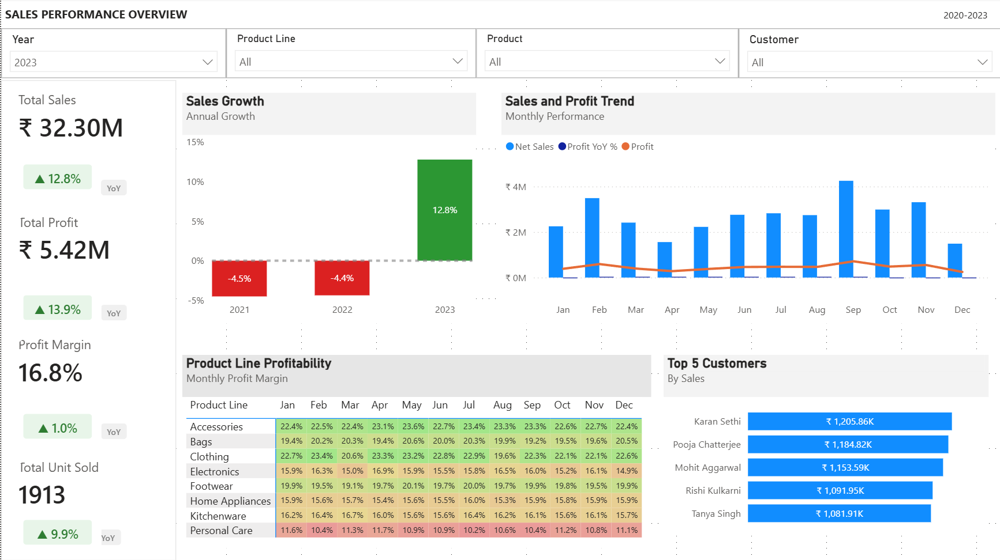
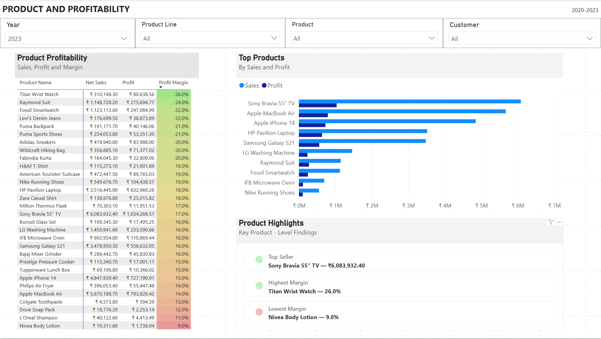
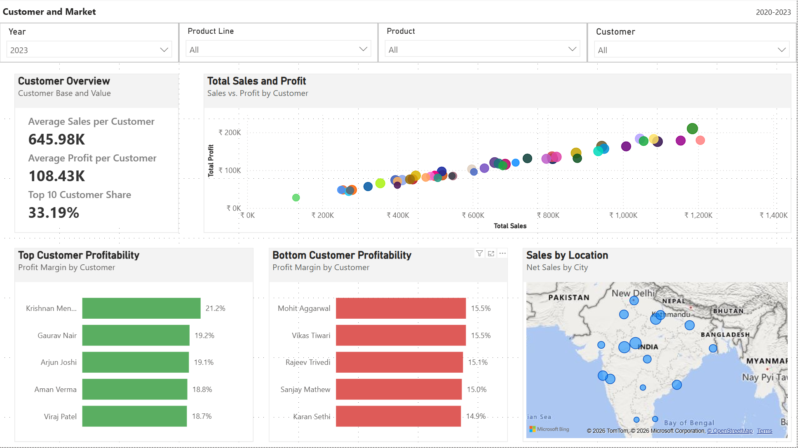
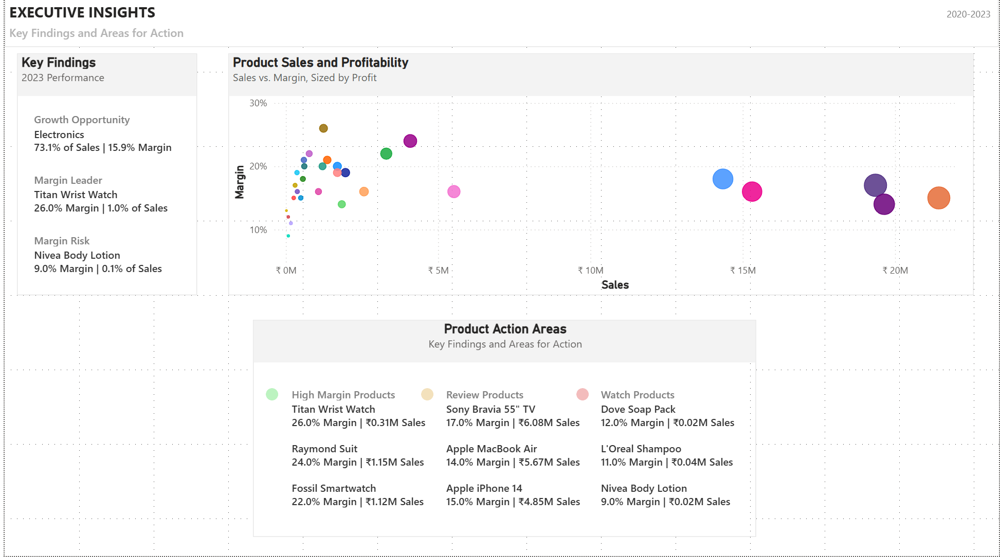

# Power BI Sales & Profitability Analysis

## Overview

This project is an interactive Power BI dashboard built to analyze sales performance, profitability, product performance, customer behavior, and market performance.

The goal was to transform transactional sales data into meaningful business insights and provide an interactive report that allows users to explore performance across different dimensions.

The dashboard was independently designed and developed, including the data analysis, visualizations, DAX measures, interactive slicers, and business insights.

---

## Business Objectives

The analysis focuses on answering key business questions:

- How is sales performance changing over time?
- Which products and product lines contribute the most to sales and profit?
- Which products have the strongest and weakest profitability?
- How do customers and markets contribute to overall performance?
- Where are the main opportunities for growth?
- Which areas present potential profitability or margin risks?

---

## Dataset

The source dataset was provided as part of a Udemy data analytics course.

The dataset was used as a learning resource, while the data analysis, dashboard design, visualizations, DAX measures, and business insights in this project were independently developed by me.

The dataset contains transactional sales data along with supporting information related to products, customers, markets, and promotions.

---

##  Analysis

The dashboard is organized into four main analytical areas.

### 1. Sales Performance Overview

Provides a view of overall sales performance and trends.

The analysis includes:

- Sales and profitability KPIs
- Sales trends over time
- Year-over-year performance
- Sales performance by product line
- Detailed sales breakdown
- Interactive filtering by product line, product, customer, and year

### 2. Product & Profitability

Focuses on understanding product-level performance and profitability.

The analysis examines:

- Sales by product
- Profitability across products
- Profit margin differences
- High- and low-performing products
- Product-level opportunities and risks

### 3. Customer & Market

Examines how different customers and markets contribute to overall performance.

The analysis includes:

- Customer performance
- Sales by city
- Profitability by market
- Profit margin across geographic areas
- Customer-level filtering and comparison

### 4. Executive Insights

Summarizes the most important findings from the analysis to provide a higher-level view for business decision-making.

This page highlights:

- Growth opportunities
- Margin leaders
- Margin risks
- High-margin products
- Products requiring attention
- Areas that should be monitored

---

##  Key Findings

The analysis highlights several differences in sales performance and profitability across products, customers, and markets.

Key findings from the dashboard include:

- Identification of products representing potential growth opportunities.
- Identification of products with strong profit margins that can be considered margin leaders.
- Identification of products and areas presenting potential margin risks.
- Identification of high-margin products with opportunities to scale.
- Identification of products requiring further review based on their performance.
- Identification of products that should be monitored for changes in sales and profitability.

These findings are consolidated in the Executive Insights page to provide a concise view of the areas that may require business attention.

---

##  Dashboard

### Sales Performance Overview

### Product & Profitability

### Customer & Market

### Executive Insights

---

##  Tools & Technologies

- **Power BI**
- **DAX**
- **Microsoft Excel**
- Data Modeling
- Data Analysis
- Data Visualization

---

##  Project Files

| File | Description |
|---|---|
| `Sales Report.pbix` | Power BI report containing the complete dashboard, data model, and analysis |
| `Store+Data.xlsx` | Source dataset provided through the Udemy course |
| `Preview/` | Dashboard screenshots |
| `Store+Data.xlsx` | Source dataset provided through the Udemy course |
